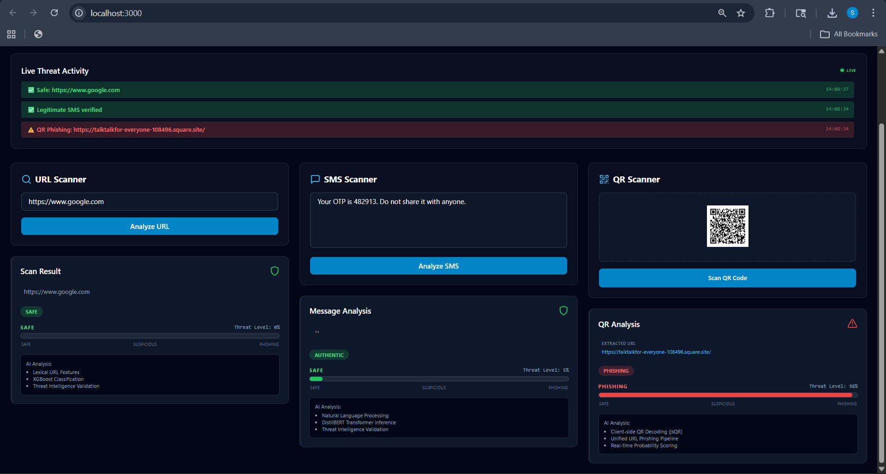

# CyberSentinel

CyberSentinel is an AI-powered multi-modal cybersecurity system designed for real-time phishing detection across URLs, SMS, and QR codes. It combines a centralized dashboard with a proactive browser extension to provide end-to-end protection.

---

## Overview

Phishing attacks have evolved beyond email into multiple channels. CyberSentinel addresses:

- **Phishing**: Malicious URLs targeting user credentials  
- **Smishing**: SMS-based social engineering attacks  
- **Quishing**: QR codes embedding fraudulent links  

The system leverages machine learning and NLP to analyze threats and generate real-time risk assessments.

---

## Features

- **Unified Detection Pipeline**: Single `/predict` API for all input types  
- **XGBoost-based URL Detection**: Uses lexical and structural feature analysis  
- **Smishing Detection**: NLP + TF-IDF pipeline for SMS classification  
- **Frontend QR Decoding**: Fast client-side extraction using `jsQR`  
- **Real-time Browser Protection**: Chrome extension scans links and images  
- **Dynamic Risk Scoring**: Confidence-driven risk meter (no hardcoded values)  

---

## How to Use

### 1. Clone the Repository
```bash
git clone https://github.com/Sankethhhhhhh/CyberSentinel.git
cd CyberSentinel
```

### 2. Start Backend (FastAPI)
```bash
cd backend
pip install -r requirements.txt
python app/main.py
```

**Backend runs at:**
`http://127.0.0.1:8000`

### 3. Start Frontend (React)
```bash
cd frontend
npm install
npm run dev
```

**Open:**
`http://localhost:3000`

### 4. Load Chrome Extension
1. Open `chrome://extensions/`
2. Enable **Developer Mode**
3. Click **Load unpacked**
4. Select `CyberSentinel_Extension/`

---

## System Architecture

```text
User Input (URL / SMS / QR)
        ↓
Frontend (React / Chrome Extension)
        ↓
FastAPI Backend (/predict)
        ↓
Inference Module
        ↓
ML Models (XGBoost + NLP)
        ↓
Prediction (label + confidence)
        ↓
Dashboard / Browser Highlighting
```

---

## API Specification

**Endpoint**
`POST /predict`

**Request**
```json
{
  "input_type": "url",
  "data": "http://suspicious-login.com"
}
```

**Response**
```json
{
  "label": "phishing",
  "confidence": 0.942,
  "risk_level": "HIGH"
}
```

---

## Screenshots



---

## Recent Improvements

- Unified all detection workflows under `/predict`
- Fixed confidence calibration (removed constant 100% issue)
- Integrated QR scanning directly into frontend
- Improved SMS pipeline with optimized TF-IDF + Scikit-learn
- Enhanced extension to scan both links and images in real-time

---

## Deployment

CyberSentinel is currently optimized for local execution. Deployment to cloud infrastructure (AWS/Azure) is in progress and will be available in upcoming updates.

---

## Future Improvements

- Explainable AI (model reasoning output)
- Domain reputation integration (VirusTotal / Safe Browsing)
- Batch scanning optimization for large-scale webpages
- Cloud deployment and scalability improvements

---

## License

This project is licensed under the MIT License and is intended for educational and research purposes.
